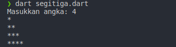
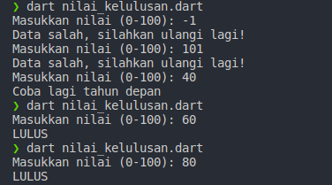
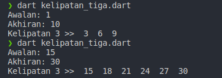
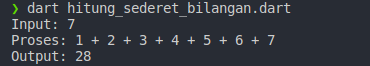
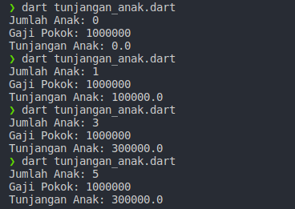

# Evaluasi Dasar-Dasar Dart
Mahasiswa  mampu  mampu  mengimplementasikan  konsep  pemrograman dasar dengan menggunakan Bahasa Dart  

## Tabel Program dan Hasil Screenshot
| No | Nama | Screenshot |
|----|------|------------|
|1   | [Segitiga](bin/segitiga.dart) |  |
|2   | [Nilai Kelulusan](bin/nilai_kelulusan.dart) |  |
|3   | [Kelipatan Tiga](bin/kelipatan_tiga.dart) |  |
|4   | [Hitung Sederet Bilangan](bin/hitung_sederet_bilangan.dart) |  |
|5   | [Tunjangan Anak](bin/tunjangan_anak.dart) |  |
